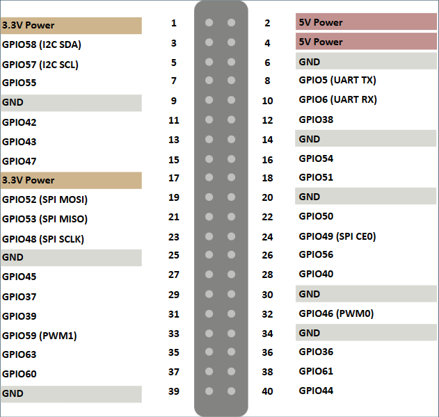

# 昉・星光开发板炫彩灯环控制

这个 Demo 我个人在 VisionFive 1 上测试失败了

---

## 需要的材料

 - VisionFive 2 开发板
 - OS: openEuler RISC-V
 - 24 灯珠 WS2812B 灯环
   - 这里采用 DFRobot WS2812-16 RGB LED 灯环
 - 杜邦线

## 前期准备

安装必要的依赖:

```bash
sudo dnf install python python3-numpy python3-devel python3-tkinter
```

获取 `py-neopixel-spidev` 扩展库：

```bash
git clone https://github.com/fschrempf/py-neopixel-spidev.git
cd py-neopixel-spidev
python setup.py build
sudo python setup.py install
```

## 连接线路

一头连接 IN 口，一头连接开发板。根据官方的文档:

| Num | Label | Description         |
| --- | ----- | ------------------- |
| 1   | D     | Digital signal port |
| 2   | +     | VCC                 |
| 3   | -     | GND                 |

我们需要将 `-` 连接至任意 `GND`（6、9、14、20、25、30、34、39 号都可以），`+` 连接至 2 号或 4 号供电口（我们需要 5V 供电），`D` 连接至第 19 号 `GPIO52 (SPI MOSI)`。



## 开始点灯

在 `py-neopixel-spidev` 目录内运行:

```bash
sudo python3 ws2812b_gui.py
```

## 排错

### `self.spi.open(bus, dev)` 找不到设备

请检查 SPI 设备:

```bash
ls -l /dev/spi* 
```

实例代码内假设你的设备为 `/dev/spidev1.0`，如果设备为 `/dev/spidev0.0`，请自行修改 `bus` 和 `chipselect` 两个参数。

## 参考资料

 - [WS2812-24 RGB LED Ring Lamp Light Wiki - DFRobot](https://wiki.dfrobot.com/SKU_DFR0888_RGB_LED_Ring)
 - [昉・星光系列课程 14：昉・星光开发板炫彩灯环控制](https://forum.rvspace.org/t/topic/2833)
